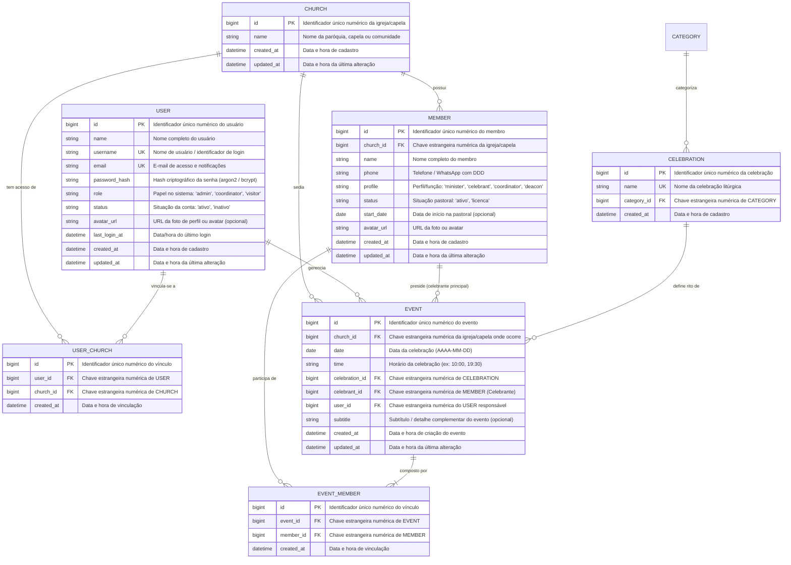

# 📊 Recomendação de DER (Diagrama de Entidade-Relacionamento)

Este documento apresenta a modelagem de dados recomendada para o ecossistema da **Escala Virtual (Capela Divino Espírito Santo e Paróquias)**, padronizada com nomenclatura técnica em **inglês** para tabelas e colunas, com identificadores **numéricos inteiros** (`BIGINT` / `INTEGER` / `BIGSERIAL`) e preparada para bancos de dados relacionais (*PostgreSQL*, *SQLite*, *Supabase* ou *MySQL*).

---

## 🏛️ 1. Diagrama Entidade-Relacionamento (Mermaid)



---

## 📋 2. Dicionário de Dados

### 2.1. Tabela `CHURCH` (`churches`)
Armazena as paróquias, capelas ou comunidades cadastradas no sistema, viabilizando a gestão descentralizada ou multicomunidades.

| Campo | Tipo Recomendado | Nulo? | Chave | Descrição & Regras de Negócio |
| :--- | :--- | :---: | :---: | :--- |
| `id` | `BIGSERIAL` / `BIGINT` | **NÃO** | **PK** | Identificador único numérico (ex: `1`, `2`, `3`). |
| `name` | `VARCHAR(150)` | **NÃO** | - | Nome da igreja, paróquia ou capela (ex: *"Capela Divino Espírito Santo"*). |
| `created_at` | `TIMESTAMP` | **NÃO** | - | Data e hora de inclusão da igreja no cadastro. |
| `updated_at` | `TIMESTAMP` | SIM | - | Data e hora da última alteração cadastral. |

---

### 2.2. Tabela `USER` (`users`)
Representa o usuário autenticado no sistema (administrador, coordenador ou visitante).

| Campo | Tipo Recomendado | Nulo? | Chave | Descrição |
| :--- | :--- | :---: | :---: | :--- |
| `id` | `BIGSERIAL` / `BIGINT` | **NÃO** | **PK** | Identificador único numérico do usuário. |
| `name` | `VARCHAR(150)` | **NÃO** | - | Nome completo de exibição. |
| `username` | `VARCHAR(80)` | **NÃO** | **UK, IDX** | Nome de usuário único para login (ex: `"admin.pastoral"`, `"maria.silva"`). |
| `email` | `VARCHAR(150)` | **NÃO** | **UK, IDX** | E-mail de identificação e notificações. |
| `password_hash` | `VARCHAR(255)` | **NÃO** | - | Hash criptografado da senha (ex: bcrypt, argon2). |
| `role` | `VARCHAR(50)` | **NÃO** | - | Papel de acesso no sistema: `'admin'`, `'coordinator'`, `'visitor'`. Padrão: `'coordinator'`. |
| `status` | `VARCHAR(20)` | **NÃO** | - | Situação da conta: `'ativo'`, `'inativo'`. Padrão: `'ativo'`. |
| `avatar_url` | `TEXT` | SIM | - | URL da foto do perfil (opcional). |
| `last_login_at` | `TIMESTAMP` | SIM | - | Timestamp do último acesso bem-sucedido. |
| `created_at` | `TIMESTAMP` | **NÃO** | - | Data e hora de cadastro do usuário. |
| `updated_at` | `TIMESTAMP` | SIM | - | Data e hora da última alteração cadastral. |
| `deleted_at` | `TIMESTAMP` | SIM | - | Data e hora de exclusão lógica (*soft delete*). |

---

### 2.3. Tabela `USER_CHURCH` (`user_churches`)
Tabela associativa que implementa a relação N:N entre usuários e igrejas/capelas, permitindo que coordenadores e administradores gerenciem uma ou mais comunidades.

| Campo | Tipo Recomendado | Nulo? | Chave | Descrição & Regras de Negócio |
| :--- | :--- | :---: | :---: | :--- |
| `id` | `BIGSERIAL` / `BIGINT` | **NÃO** | **PK** | Identificador único numérico do vínculo. |
| `user_id` | `BIGINT` | **NÃO** | **FK, IDX** | Chave estrangeira numérica da tabela `users`. |
| `church_id` | `BIGINT` | **NÃO** | **FK, IDX** | Chave estrangeira numérica da tabela `churches`. |
| `created_at` | `TIMESTAMP` | **NÃO** | - | Data e hora em que o acesso/vínculo foi concedido. |

---

### 2.4. Tabela `CATEGORY` (`categories`)
Catálogo de categorias litúrgicas que classificam os tipos de celebrações.

| Campo | Tipo Recomendado | Nulo? | Chave | Descrição & Regras de Negócio |
| :--- | :--- | :---: | :---: | :--- |
| `id` | `BIGSERIAL` / `BIGINT` | **NÃO** | **PK** | Identificador único numérico (ex: `1`, `2`, `3`). |
| `name` | `VARCHAR(100)` | **NÃO** | **UK** | Nome da categoria litúrgica (ex: *"Dominical"*, *"Semanal"*, *"Solenidade"*, *"Sacramento"*, *"Especial"*). |
| `description` | `TEXT` | SIM | - | Descrição detalhada sobre o significado ou preceito da categoria. |
| `created_at` | `TIMESTAMP` | **NÃO** | - | Data e hora de inclusão da categoria no cadastro. |

---

### 2.5. Tabela `CELEBRATION` (`celebrations`)
Catálogo padronizado de ritos e celebrações da paróquia vinculados a uma categoria.

| Campo | Tipo Recomendado | Nulo? | Chave | Descrição & Regras de Negócio |
| :--- | :--- | :---: | :---: | :--- |
| `id` | `BIGSERIAL` / `BIGINT` | **NÃO** | **PK** | Identificador único numérico da celebração. |
| `name` | `VARCHAR(150)` | **NÃO** | **UK** | Nome da celebração litúrgica (ex: *"Santa Missa Dominical"*). |
| `category_id` | `BIGINT` | SIM | **FK** | Chave estrangeira numérica para a tabela `categories`. |
| `created_at` | `TIMESTAMP` | **NÃO** | - | Data e hora de cadastro da celebração. |

---

### 2.6. Tabela `MEMBER` (`members`)
Armazena todos os membros cadastrados na pastoral com suas informações de contato, perfil/função pastoral, situação e igreja à qual pertencem.

| Campo | Tipo Recomendado | Nulo? | Chave | Descrição & Regras de Negócio |
| :--- | :--- | :---: | :---: | :--- |
| `id` | `BIGSERIAL` / `BIGINT` | **NÃO** | **PK** | Identificador único numérico do membro. |
| `church_id` | `BIGINT` | **NÃO** | **FK, IDX** | Chave estrangeira numérica para a tabela `churches` (igreja/capela do membro). |
| `name` | `VARCHAR(150)` | **NÃO** | - | Nome completo do membro. |
| `phone` | `VARCHAR(25)` | SIM | - | Telefone com DDD e formato WhatsApp: `(11) 99999-0000`. |
| `profile` | `VARCHAR(50)` | **NÃO** | - | Perfil/Função ministerial (domínio: `'minister'`, `'celebrant'`, `'coordinator'`, `'deacon'`). Padrão: `'minister'`. |
| `status` | `VARCHAR(20)` | **NÃO** | - | Domínio: `'ativo'`, `'licenca'`. |
| `start_date` | `DATE` | SIM | - | Data em que ingressou na pastoral (opcional). |
| `avatar_url` | `TEXT` | SIM | - | URL da foto de perfil ou `null` (gera avatar com iniciais). |
| `created_at` | `TIMESTAMP` | **NÃO** | - | Data e hora de inclusão no cadastro. |
| `updated_at` | `TIMESTAMP` | SIM | - | Data e hora da última alteração de cadastro. |

---

### 2.7. Tabela `EVENT` (`events`)
Representa a celebração em determinada data, hora e igreja/capela para a qual membros são convocados na escala.

| Campo | Tipo Recomendado | Nulo? | Chave | Descrição & Regras de Negócio |
| :--- | :--- | :---: | :---: | :--- |
| `id` | `BIGSERIAL` / `BIGINT` | **NÃO** | **PK** | Identificador único numérico do evento. |
| `church_id` | `BIGINT` | **NÃO** | **FK, IDX** | Referência numérica para a tabela `churches` (igreja/capela onde ocorre o evento). |
| `date` | `DATE` | **NÃO** | **IDX** | Data da celebração (`AAAA-MM-DD`). |
| `time` | `VARCHAR(10)` | **NÃO** | - | Horário no formato `HH:mm` (ex: `10:00`, `19:30`). |
| `celebration_id` | `BIGINT` | SIM | **FK** | Referência numérica para a tabela `celebrations`. |
| `celebrant_id` | `BIGINT` | SIM | **FK** | Referência numérica para a tabela `members` (celebrante/presidente principal da celebração). |
| `user_id` | `BIGINT` | SIM | **FK** | Referência numérica para a tabela `users` (usuário responsável pelo evento). |
| `subtitle` | `VARCHAR(150)` | SIM | - | Subtítulo ou tema complementar do evento (ex: *"Bodas de Prata"*, *"1ª Sexta-feira"*). |
| `created_at` | `TIMESTAMP` | **NÃO** | - | Data e hora de criação do evento. |
| `updated_at` | `TIMESTAMP` | SIM | - | Data e hora da última alteração. |

---

### 2.8. Tabela `EVENT_MEMBER` (`event_members`)
Tabela associativa pura que vincula os membros da equipe escalados para o evento.

| Campo | Tipo Recomendado | Nulo? | Chave | Descrição & Regras de Negócio |
| :--- | :--- | :---: | :---: | :--- |
| `id` | `BIGSERIAL` / `BIGINT` | **NÃO** | **PK** | Identificador único numérico do vínculo. |
| `event_id` | `BIGINT` | **NÃO** | **FK, IDX** | Chave estrangeira numérica da tabela `events`. |
| `member_id` | `BIGINT` | **NÃO** | **FK, IDX** | Chave estrangeira numérica da tabela `members`. |
| `created_at` | `TIMESTAMP` | **NÃO** | - | Data e hora em que o membro foi vinculado ao evento. |

---

## 🔗 3. Cardinalidades e Regras de Negócio

1. **`USER` N : N `CHURCH` (via `user_churches`)**:
   - Um usuário coordenador ou administrador pode ter acesso para gerenciar escalas em múltiplas igrejas/capelas.
   - Uma igreja/capela possui múltiplos usuários com permissão de gestão.

2. **`CHURCH` 1 : N `MEMBER`**:
   - Uma igreja/capela possui um corpo ministerial e celebrantes cadastrados que atuam em sua comunidade.

3. **`CHURCH` 1 : N `EVENT`**:
   - Uma igreja/capela sedia múltiplos eventos litúrgicos e celebrações ao longo do calendário.

4. **`CATEGORY` 1 : N `CELEBRATION`**:
   - Uma categoria litúrgica classifica múltiplas celebrações cadastradas na paróquia.

5. **`CELEBRATION` 1 : N `EVENT`**:
   - Uma celebração do catálogo define o nome e rito de múltiplos eventos no calendário.

6. **`MEMBER` 1 : N `EVENT` (Celebrante Principal)**:
   - Um membro (com perfil `'celebrant'`, `'deacon'` ou `'minister'`) pode presidir diversos eventos litúrgicos como presidente principal (`celebrant_id`).

7. **`MEMBER` 1 : N `EVENT_MEMBER` (Equipe Ministerial)**:
   - Um membro pode participar de nenhum, um ou vários eventos ao longo do mês/ano.
   - O total de escalas do membro no mês é calculado dinamicamente via agregação (`COUNT`) na tabela `event_members` para alertar sobrecarga ministerial (ex: ≥ 3 escalas).

8. **`EVENT` 1 : N `EVENT_MEMBER`**:
   - Um evento é composto por membros escalados vinculados via `event_members`.
   - A remoção de um evento em cascata remove os registros correspondentes em `event_members`.

9. **`USER` 1 : N `EVENT`**:
   - Um usuário administrador cria e gerencia múltiplos eventos/escalas.

10. **Restrições de Unicidade**:
    - `UNIQUE(user_id, church_id)`: Um usuário não pode ser vinculado em duplicidade à mesma igreja.
    - `UNIQUE(event_id, member_id)`: Um membro não pode ser adicionado em duplicidade no mesmo evento.
    - `UNIQUE(date, time, church_id)`: Não pode haver mais de um evento para o mesmo horário e data na mesma igreja/capela.

---

## 💾 4. Script DDL Sugerido (PostgreSQL / SQLite)

```sql
-- 1. Tabela de Igrejas / Capelas (Churches)
CREATE TABLE churches (
    id BIGSERIAL PRIMARY KEY,
    name VARCHAR(150) NOT NULL,
    created_at TIMESTAMP NOT NULL DEFAULT CURRENT_TIMESTAMP,
    updated_at TIMESTAMP DEFAULT CURRENT_TIMESTAMP
);

-- 2. Tabela de Usuários (Users)
CREATE TABLE users (
    id BIGSERIAL PRIMARY KEY,
    name VARCHAR(150) NOT NULL,
    username VARCHAR(80) NOT NULL UNIQUE,
    email VARCHAR(150) NOT NULL UNIQUE,
    password_hash VARCHAR(255) NOT NULL,
    role VARCHAR(50) NOT NULL DEFAULT 'coordinator' CHECK (role IN ('admin', 'coordinator', 'visitor')),
    status VARCHAR(20) NOT NULL DEFAULT 'ativo' CHECK (status IN ('ativo', 'inativo')),
    avatar_url TEXT,
    last_login_at TIMESTAMP,
    created_at TIMESTAMP NOT NULL DEFAULT CURRENT_TIMESTAMP,
    updated_at TIMESTAMP DEFAULT CURRENT_TIMESTAMP,
    deleted_at TIMESTAMP
);

CREATE INDEX idx_users_username ON users(username);
CREATE INDEX idx_users_email ON users(email);
CREATE INDEX idx_users_role ON users(role);
CREATE INDEX idx_users_status ON users(status);

-- 3. Tabela Associativa Usuário-Igreja (User Churches - Relação N:N)
CREATE TABLE user_churches (
    id BIGSERIAL PRIMARY KEY,
    user_id BIGINT NOT NULL REFERENCES users(id) ON DELETE CASCADE,
    church_id BIGINT NOT NULL REFERENCES churches(id) ON DELETE CASCADE,
    created_at TIMESTAMP NOT NULL DEFAULT CURRENT_TIMESTAMP,
    CONSTRAINT unq_user_church UNIQUE (user_id, church_id)
);

-- 4. Tabela de Categorias (Categories)
CREATE TABLE categories (
    id BIGSERIAL PRIMARY KEY,
    name VARCHAR(100) NOT NULL UNIQUE,
    description TEXT,
    created_at TIMESTAMP NOT NULL DEFAULT CURRENT_TIMESTAMP
);

-- 5. Tabela de Celebrações (Celebrations)
CREATE TABLE celebrations (
    id BIGSERIAL PRIMARY KEY,
    name VARCHAR(150) NOT NULL UNIQUE,
    category_id BIGINT REFERENCES categories(id) ON DELETE SET NULL,
    created_at TIMESTAMP NOT NULL DEFAULT CURRENT_TIMESTAMP
);

-- 6. Tabela de Membros (Members)
CREATE TABLE members (
    id BIGSERIAL PRIMARY KEY,
    church_id BIGINT NOT NULL REFERENCES churches(id) ON DELETE RESTRICT,
    name VARCHAR(150) NOT NULL,
    phone VARCHAR(25),
    profile VARCHAR(50) NOT NULL DEFAULT 'minister' CHECK (profile IN ('minister', 'celebrant', 'coordinator', 'deacon')),
    status VARCHAR(20) NOT NULL DEFAULT 'ativo' CHECK (status IN ('ativo', 'licenca')),
    start_date DATE,
    avatar_url TEXT,
    created_at TIMESTAMP NOT NULL DEFAULT CURRENT_TIMESTAMP,
    updated_at TIMESTAMP DEFAULT CURRENT_TIMESTAMP
);

-- 7. Tabela de Eventos / Escalas (Events)
CREATE TABLE events (
    id BIGSERIAL PRIMARY KEY,
    church_id BIGINT NOT NULL REFERENCES churches(id) ON DELETE RESTRICT,
    date DATE NOT NULL,
    time VARCHAR(10) NOT NULL,
    celebration_id BIGINT REFERENCES celebrations(id) ON DELETE SET NULL,
    celebrant_id BIGINT REFERENCES members(id) ON DELETE SET NULL,
    user_id BIGINT REFERENCES users(id) ON DELETE SET NULL,
    subtitle VARCHAR(150),
    created_at TIMESTAMP NOT NULL DEFAULT CURRENT_TIMESTAMP,
    updated_at TIMESTAMP DEFAULT CURRENT_TIMESTAMP,
    CONSTRAINT unq_event_date_time_church UNIQUE (date, time, church_id)
);

-- 8. Tabela Associativa Evento-Membro (Event Members)
CREATE TABLE event_members (
    id BIGSERIAL PRIMARY KEY,
    event_id BIGINT NOT NULL REFERENCES events(id) ON DELETE CASCADE,
    member_id BIGINT NOT NULL REFERENCES members(id) ON DELETE RESTRICT,
    created_at TIMESTAMP NOT NULL DEFAULT CURRENT_TIMESTAMP,
    CONSTRAINT unq_event_member UNIQUE (event_id, member_id)
);

-- 9. Índices para Otimização de Consultas (Indexes)
CREATE INDEX idx_user_churches_user ON user_churches(user_id);
CREATE INDEX idx_user_churches_church ON user_churches(church_id);
CREATE INDEX idx_members_church ON members(church_id);
CREATE INDEX idx_events_church ON events(church_id);
CREATE INDEX idx_celebrations_category ON celebrations(category_id);
CREATE INDEX idx_events_date ON events(date);
CREATE INDEX idx_events_celebrante ON events(celebrant_id);
CREATE INDEX idx_evento_membros_evento ON event_members(event_id);
CREATE INDEX idx_evento_membros_membro ON event_members(member_id);
CREATE INDEX idx_membros_status ON members(status);
CREATE INDEX idx_membros_profile ON members(profile);
```
