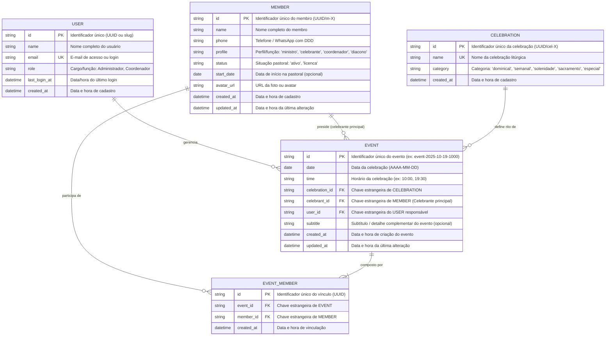

# 📊 Recomendação de DER (Diagrama de Entidade-Relacionamento)

Este documento apresenta a modelagem de dados recomendada para o ecossistema da **Escala Virtual (Capela Divino Espírito Santo)**, padronizada com nomenclatura técnica em **inglês** para tabelas e colunas, baseada na estrutura real da aplicação (*Store / Membros / Eventos*) e preparada para bancos de dados relacionais (*PostgreSQL*, *SQLite*, *Supabase* ou *MySQL*).

---

## 🏛️ 1. Diagrama Entidade-Relacionamento (Mermaid)



---

## 📋 2. Dicionário de Dados

### 2.1. Tabela `MEMBER` (`members`)
Armazena todos os membros cadastrados na pastoral com suas informações de contato, perfil/função pastoral e situação.

| Campo | Tipo Recomendado | Nulo? | Chave | Descrição & Regras de Negócio |
| :--- | :--- | :---: | :---: | :--- |
| `id` | `VARCHAR(36)` / `UUID` | **NÃO** | **PK** | Identificador único do membro. |
| `name` | `VARCHAR(150)` | **NÃO** | - | Nome completo do membro. |
| `phone` | `VARCHAR(25)` | SIM | - | Telefone com DDD e formato WhatsApp: `(11) 99999-0000`. |
| `profile` | `VARCHAR(50)` | **NÃO** | - | Perfil/Função ministerial (ex: `'ministro'`, `'celebrante'`, `'coordenador'`, `'diacono'`). Padrão: `'ministro'`. |
| `status` | `VARCHAR(20)` | **NÃO** | - | Domínio: `'ativo'`, `'licenca'`. |
| `start_date` | `DATE` | SIM | - | Data em que ingressou na pastoral (opcional). |
| `avatar_url` | `TEXT` | SIM | - | URL da foto de perfil ou `null` (gera avatar com iniciais). |
| `created_at` | `TIMESTAMP` | **NÃO** | - | Data e hora de inclusão no cadastro. |
| `updated_at` | `TIMESTAMP` | SIM | - | Data e hora da última alteração de cadastro. |

---

### 2.2. Tabela `CELEBRATION` (`celebrations`)
Catálogo padronizado de tipos de celebrações da paróquia.

| Campo | Tipo Recomendado | Nulo? | Chave | Descrição & Regras de Negócio |
| :--- | :--- | :---: | :---: | :--- |
| `id` | `VARCHAR(36)` / `UUID` | **NÃO** | **PK** | Identificador único da celebração. |
| `name` | `VARCHAR(150)` | **NÃO** | **UK** | Nome da celebração litúrgica (ex: *"Santa Missa Dominical"*). |
| `category` | `VARCHAR(30)` | **NÃO** | - | Domínio: `'dominical'`, `'semanal'`, `'solenidade'`, `'sacramento'`, `'especial'`. |
| `created_at` | `TIMESTAMP` | **NÃO** | - | Data e hora de cadastro da celebração. |

---

### 2.3. Tabela `EVENT` (`events`)
Representa a celebração em determinada data e hora para a qual membros são convocados na escala.

| Campo | Tipo Recomendado | Nulo? | Chave | Descrição & Regras de Negócio |
| :--- | :--- | :---: | :---: | :--- |
| `id` | `VARCHAR(60)` | **NÃO** | **PK** | Identificador único gerado (ex: `event-2025-10-19-1000`). |
| `date` | `DATE` | **NÃO** | **IDX** | Data da celebração (`AAAA-MM-DD`). |
| `time` | `VARCHAR(10)` | **NÃO** | - | Horário no formato `HH:mm` (ex: `10:00`, `19:30`). |
| `celebration_id` | `VARCHAR(36)` | SIM | **FK** | Referência para a tabela `celebrations`. |
| `celebrant_id` | `VARCHAR(36)` | SIM | **FK** | Referência para a tabela `members` (celebrante/presidente principal da celebração). |
| `user_id` | `VARCHAR(36)` | SIM | **FK** | Referência para a tabela `users` (usuário responsável pelo evento). |
| `subtitle` | `VARCHAR(150)` | SIM | - | Subtítulo ou tema complementar do evento (ex: *"Bodas de Prata"*, *"1ª Sexta-feira"*). |
| `created_at` | `TIMESTAMP` | **NÃO** | - | Data e hora de criação do evento. |
| `updated_at` | `TIMESTAMP` | SIM | - | Data e hora da última alteração. |

---

### 2.4. Tabela `EVENT_MEMBER` (`event_members`)
Tabela associativa pura que vincula os membros da equipe escalados para o evento.

| Campo | Tipo Recomendado | Nulo? | Chave | Descrição & Regras de Negócio |
| :--- | :--- | :---: | :---: | :--- |
| `id` | `VARCHAR(36)` / `UUID` | **NÃO** | **PK** | Identificador único do vínculo. |
| `event_id` | `VARCHAR(60)` | **NÃO** | **FK, IDX** | Chave estrangeira da tabela `events`. |
| `member_id` | `VARCHAR(36)` | **NÃO** | **FK, IDX** | Chave estrangeira da tabela `members`. |
| `created_at` | `TIMESTAMP` | **NÃO** | - | Data e hora em que o membro foi vinculado ao evento. |

---

### 2.5. Tabela `USER` (`users`)
Representa o usuário autenticado no sistema.

| Campo | Tipo Recomendado | Nulo? | Chave | Descrição |
| :--- | :--- | :---: | :---: | :--- |
| `id` | `VARCHAR(36)` | **NÃO** | **PK** | Identificador único do usuário. |
| `name` | `VARCHAR(150)` | **NÃO** | - | Nome de exibição. |
| `email` | `VARCHAR(150)` | **NÃO** | **UK** | E-mail de identificação e login. |
| `role` | `VARCHAR(80)` | **NÃO** | - | Cargo/função no sistema (ex: `"Coordenador Paroquial"`, `"Administrador"`). |
| `last_login_at` | `TIMESTAMP` | SIM | - | Timestamp do último acesso. |
| `created_at` | `TIMESTAMP` | **NÃO** | - | Data e hora de cadastro do usuário. |

---

## 🔗 3. Cardinalidades e Regras de Negócio

1. **`MEMBER` 1 : N `EVENT` (Celebrante Principal)**:
   - Um membro (com perfil `'celebrante'`, `'diacono'` ou `'ministro'`) pode presidir diversos eventos litúrgicos como presidente principal (`celebrant_id`).

2. **`MEMBER` 1 : N `EVENT_MEMBER` (Equipe Ministerial)**:
   - Um membro pode participar de nenhum, um ou vários eventos ao longo do mês/ano.
   - O total de escalas do membro no mês é calculado dinamicamente via agregação (`COUNT`) na tabela `event_members` para alertar sobrecarga ministerial (ex: ≥ 3 escalas).

3. **`EVENT` 1 : N `EVENT_MEMBER`**:
   - Um evento é composto por membros escalados vinculados via `event_members`.
   - A remoção de um evento em cascata remove os registros correspondentes em `event_members`.

4. **`CELEBRATION` 1 : N `EVENT`**:
   - Uma celebração do catálogo define o nome e categoria litúrgica de múltiplos eventos no calendário.

5. **`USER` 1 : N `EVENT`**:
   - Um usuário administrador cria e gerencia múltiplos eventos/escalas.

6. **Restrições de Unicidade**:
   - `UNIQUE(event_id, member_id)`: Um membro não pode ser adicionado em duplicidade no mesmo evento.
   - `UNIQUE(date, time)`: Não pode haver mais de um evento para o mesmo horário e data na mesma capela.

---

## 💾 4. Script DDL Sugerido (PostgreSQL / SQLite)

```sql
-- 1. Tabela de Membros
CREATE TABLE members (
    id VARCHAR(36) PRIMARY KEY,
    name VARCHAR(150) NOT NULL,
    phone VARCHAR(25),
    profile VARCHAR(50) NOT NULL DEFAULT 'ministro',
    status VARCHAR(20) NOT NULL DEFAULT 'ativo' CHECK (status IN ('ativo', 'licenca')),
    start_date DATE,
    avatar_url TEXT,
    created_at TIMESTAMP NOT NULL DEFAULT CURRENT_TIMESTAMP,
    updated_at TIMESTAMP DEFAULT CURRENT_TIMESTAMP
);

-- 2. Tabela de Celebrações
CREATE TABLE celebrations (
    id VARCHAR(36) PRIMARY KEY,
    name VARCHAR(150) NOT NULL UNIQUE,
    category VARCHAR(30) NOT NULL CHECK (category IN ('dominical', 'semanal', 'solenidade', 'sacramento', 'especial')),
    created_at TIMESTAMP NOT NULL DEFAULT CURRENT_TIMESTAMP
);

-- 3. Tabela de Usuários
CREATE TABLE users (
    id VARCHAR(36) PRIMARY KEY,
    name VARCHAR(150) NOT NULL,
    email VARCHAR(150) NOT NULL UNIQUE,
    role VARCHAR(80) NOT NULL DEFAULT 'Coordenador',
    last_login_at TIMESTAMP,
    created_at TIMESTAMP NOT NULL DEFAULT CURRENT_TIMESTAMP
);

-- 4. Tabela de Eventos (Escalas)
CREATE TABLE events (
    id VARCHAR(60) PRIMARY KEY,
    date DATE NOT NULL,
    time VARCHAR(10) NOT NULL,
    celebration_id VARCHAR(36) REFERENCES celebrations(id) ON DELETE SET NULL,
    celebrant_id VARCHAR(36) REFERENCES members(id) ON DELETE SET NULL,
    user_id VARCHAR(36) REFERENCES users(id) ON DELETE SET NULL,
    subtitle VARCHAR(150),
    created_at TIMESTAMP NOT NULL DEFAULT CURRENT_TIMESTAMP,
    updated_at TIMESTAMP DEFAULT CURRENT_TIMESTAMP,
    CONSTRAINT unq_event_date_time UNIQUE (date, time)
);

-- 5. Tabela Associativa Evento-Membro
CREATE TABLE event_members (
    id VARCHAR(36) PRIMARY KEY,
    event_id VARCHAR(60) NOT NULL REFERENCES events(id) ON DELETE CASCADE,
    member_id VARCHAR(36) NOT NULL REFERENCES members(id) ON DELETE RESTRICT,
    created_at TIMESTAMP NOT NULL DEFAULT CURRENT_TIMESTAMP,
    CONSTRAINT unq_event_member UNIQUE (event_id, member_id)
);

-- 6. Índices para Otimização de Consultas
CREATE INDEX idx_events_date ON events(date);
CREATE INDEX idx_events_celebrant ON events(celebrant_id);
CREATE INDEX idx_event_members_event ON event_members(event_id);
CREATE INDEX idx_event_members_member ON event_members(member_id);
CREATE INDEX idx_members_status ON members(status);
CREATE INDEX idx_members_profile ON members(profile);
```

---

## 🚀 5. Mapeamento Direto com o Store Atual

| Entidade no DER | Chave / Estrutura no `store.js` | Métodos Relacionados |
| :--- | :--- | :--- |
| **`MEMBER`** | `STORAGE_KEY_MEMBERS` (`mesc_portal_members_v2`) | `getMembers()`, `getMemberById()`, `addMember()`, `updateMember()`, `deleteMember()` |
| **`CELEBRATION`** | `STORAGE_KEY_CELEBRATIONS` (`mesc_portal_celebrations_v2`) | `getCelebrations()`, `getCelebrationObjects()`, `addCelebration()`, `updateCelebration()`, `deleteCelebration()` |
| **`EVENT`** | `STORAGE_KEY_SCALES` (`mesc_portal_scales_v2`) | `getScalesForMonth()`, `getScaleByDateAndHour()`, `saveScale()`, `deleteScale()` |
| **`EVENT_MEMBER`** | `scale.ministers` (array de membros vinculados ao evento) | Adição/remoção de ministros no Passo 3 (`assignCandidateMinister`, `removeAssignedMinister`) |
| **`USER`** | `STORAGE_KEY_USER` (`mesc_portal_user_v2`) | `getCurrentUser()`, `login()`, `logout()` |
