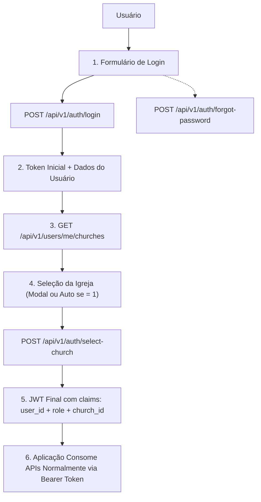
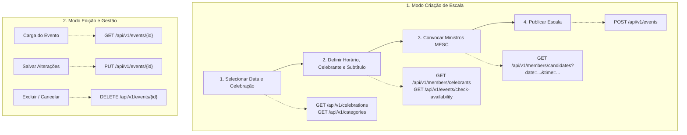
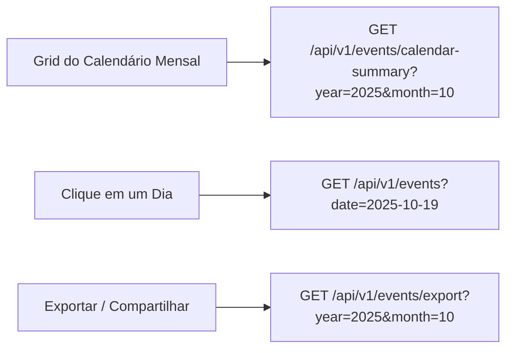
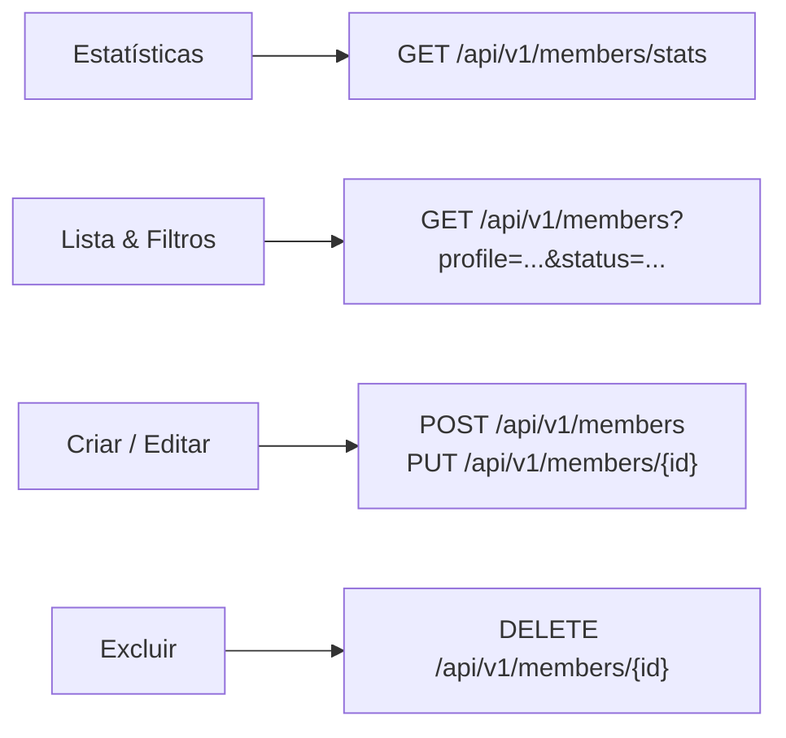
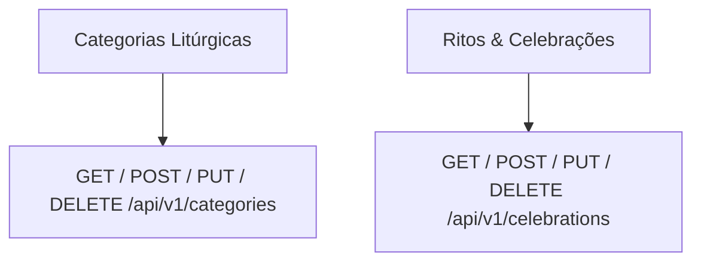
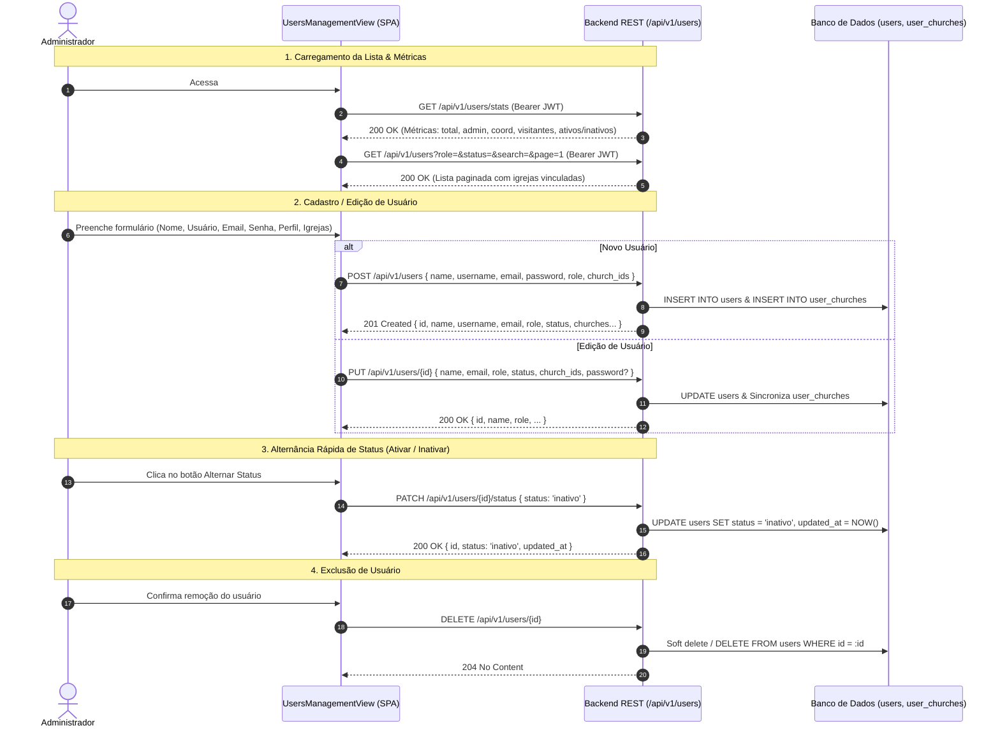

# 📡 Especificação de Contratos de API REST (Agrupada por Páginas / Telas)

Este documento apresenta a especificação técnica formal e contratos de **API RESTful (JSON)** para todo o ecossistema da **Escala Virtual (Capela Divino Espírito Santo)**, organizado e agrupado por **páginas/telas da aplicação** e 100% alinhado ao modelo de dados do **DER** ([`docs/DER_RECOMENDADO.md`](file:///home/henrique/git/virtual_scale/docs/DER_RECOMENDADO.md)).

> [!IMPORTANT]
> **Identificadores Numéricos**: Todos os identificadores únicos (`id`) e chaves estrangeiras (`*_id`, `minister_ids`) são do tipo **numérico inteiro** (`number` em JSON/TypeScript e `BIGINT` / `INTEGER` no banco de dados).

---

## 📑 Sumário de Navegação Rápida

- [🏛️ 1. Padrões e Convenções Globais da API](#️-1-padrões-e-convenções-globais-da-api)
- [🔐 2. Página: Login, Autenticação & Seleção de Igreja (`LoginView`)](#-2-página-login-autenticação--seleção-de-igreja-loginview)
- [✍️ 3. Página: Montar Escala (`RosterView`)](#️-3-página-montar-escala-rosterview)
- [📅 4. Página: Calendário de Missas & Escalas (`CalendarView`)](#-4-página-calendário-de-missas--escalas-calendarview)
- [👥 5. Página: Gestão de Membros & Ministros (`MembersView`)](#-5-página-gestão-de-membros--ministros-membersview)
- [📖 6. Página: Catálogo de Celebrações & Categorias (`CelebrationsView`)](#-6-página-catálogo-de-celebrações--categorias-celebrationsview)
- [👤 7. Página: Gerenciamento e Cadastro de Usuários (`UsersManagementView`)](#-7-página-gerenciamento-e-cadastro-de-usuários-usersmanagementview)
- [💻 8. Interfaces e Tipos TypeScript Consolidados](#-8-interfaces-e-tipos-typescript-consolidados)

---

## 🏛️ 1. Padrões e Convenções Globais da API

1. **Protocolo e Formato**: REST sobre HTTPS com payloads em `application/json; charset=utf-8`.
2. **Nomenclatura de Chaves e Parâmetros**:
   - Chaves de objetos JSON, tabelas e colunas em **inglês** (`snake_case` nos payloads e bancos).
   - Descrições, mensagens de erro e documentação técnica em **português**.
3. **Tipagem de Identificadores**:
   - Chaves primárias (`id`) e chaves estrangeiras (`category_id`, `celebration_id`, `celebrant_id`, `user_id`, `member_id`, `event_id`, `minister_ids`) são do tipo **numérico** (`number` / `integer`).
4. **Formato de Datas e Timestamps**:
   - Datas: `YYYY-MM-DD` (ISO 8601, ex: `"2025-10-19"`).
   - Horários: `HH:mm` (24 horas, ex: `"10:00"`, `"19:30"`).
   - Timestamps: `YYYY-MM-DDTHH:mm:ssZ` (UTC ISO 8601).
5. **Autenticação, Autorização & Contexto da Igreja (`JWT`)**:
   - Header obrigatório: `Authorization: Bearer <jwt_token>`
   - O payload/claims do JWT identifica o usuário (`user_id`), seu papel no sistema (`role`: `'admin'` ou `'coordinator'`) e a **igreja ativa selecionada** (`church_id`).
   - O backend extrai o `church_id` automaticamente a partir do token decodificado, isolando e filtrando as consultas de banco de dados de forma transparente, **sem necessidade de parâmetros manuais de igreja** nas demais rotas da API.
6. **Padrão de Erro (RFC 7807 - Problem Details)**:
   ```json
   {
     "type": "https://api.escalas.paroquia.org/errors/validation",
     "title": "Erro de Validação de Dados",
     "status": 422,
     "code": "VALIDATION_FAILED",
     "detail": "O campo 'name' é obrigatório e deve ter no mínimo 3 caracteres.",
     "instance": "/api/v1/members",
     "timestamp": "2025-10-10T14:30:00Z"
   }
   ```

---

## 🔐 2. Página: Login, Autenticação & Seleção de Igreja (`LoginView`)

Responsável pelo controle de acesso, autenticação de coordenadores/administradores, seleção da igreja/comunidade ativa para emissão do JWT contextualizado e recuperação de credenciais.



### 2.1. `POST /api/v1/auth/login` — Autenticação de Usuário
Autentica o usuário por e-mail e senha, gerando o token de sessão JWT.

- **Método**: `POST`
- **Autenticação**: Pública
- **Request Body**:
  ```json
  {
    "email": "coordenacao@paroquia.org",
    "password": "SenhaSegura123!"
  }
  ```
- **Response `200 OK`**:
  ```json
  {
    "token": "eyJhbGciOiJIUzI1NiIsInR5cCI6IkpXVCJ9...",
    "token_type": "Bearer",
    "expires_in": 86400,
    "user": {
      "id": 1,
      "name": "Coordenador(a) Geral",
      "email": "coordenacao@paroquia.org",
      "role": "admin",
      "last_login_at": "2025-09-10T22:00:00Z"
    }
  }
  ```
- **Response `401 Unauthorized`**:
  ```json
  {
    "type": "https://api.escalas.paroquia.org/errors/unauthorized",
    "title": "Credenciais Inválidas",
    "status": 401,
    "code": "INVALID_CREDENTIALS",
    "detail": "E-mail ou senha incorretos."
  }
  ```

### 2.2. `GET /api/v1/auth/me` — Obter Dados do Usuário Logado
Verifica se a sessão continua ativa e retorna os dados do usuário atual e da igreja ativa no token.

- **Método**: `GET`
- **Autenticação**: Bearer Token
- **Response `200 OK`**:
  ```json
  {
    "id": 1,
    "name": "Coordenador(a) Geral",
    "email": "coordenacao@paroquia.org",
    "role": "admin",
    "church_id": 1,
    "last_login_at": "2025-09-10T22:00:00Z"
  }
  ```

### 2.3. `GET /api/v1/users/me/churches` — Listagem de Igrejas do Usuário Logado
Retorna todas as igrejas/capelas às quais o usuário autenticado possui vínculo cadastrado na tabela `user_churches`. Utilizado imediatamente após o login para alimentar o modal de seleção de igreja ou selecionar automaticamente a igreja ativa caso haja apenas uma.

- **Método**: `GET`
- **Autenticação**: Bearer Token
- **Response `200 OK`**:
  ```json
  {
    "data": [
      {
        "id": 1,
        "name": "Capela Divino Espírito Santo",
        "created_at": "2025-01-01T00:00:00Z",
        "updated_at": "2025-01-01T00:00:00Z"
      },
      {
        "id": 2,
        "name": "Igreja Matriz Nossa Senhora da Candelária",
        "created_at": "2025-01-01T00:00:00Z",
        "updated_at": "2025-01-01T00:00:00Z"
      }
    ]
  }
  ```

### 2.4. `POST /api/v1/auth/select-church` — Seleção de Igreja Ativa (Emissão de JWT com Contexto)
Emite o token JWT final contendo a claim `church_id`, ativando o contexto da paróquia/capela selecionada para todas as requisições subsequentes.

- **Método**: `POST`
- **Autenticação**: Bearer Token
- **Request Body**:
  ```json
  {
    "church_id": 1
  }
  ```
- **Response `200 OK`**:
  ```json
  {
    "token": "eyJhbGciOiJIUzI1NiIsInR5cCI6IkpXVCJ9...",
    "token_type": "Bearer",
    "expires_in": 86400,
    "church": {
      "id": 1,
      "name": "Capela Divino Espírito Santo"
    }
  }
  ```

### 2.5. `POST /api/v1/auth/forgot-password` — Solicitação de Recuperação de Senha
Envia um e-mail com instruções para redefinição de senha.

- **Método**: `POST`
- **Request Body**:
  ```json
  {
    "email": "coordenacao@paroquia.org"
  }
  ```
- **Response `200 OK`**:
  ```json
  {
    "message": "Se o e-mail estiver cadastrado, as instruções de recuperação serão enviadas em instantes."
  }
  ```

---

## ✍️ 3. Página: Montar Escala (`RosterView`)

Assistente em 4 passos para seleção do rito, data/hora, celebrante, subtítulo e convocação dos ministros da equipe.



### 3.1. `GET /api/v1/celebrations` — Catálogo de Celebrações
Alimenta o seletor do rito litúrgico no **Passo 1**.

- **Método**: `GET`
- **Query Params**:
  - `category_id` *(opcional, inteiro)*: Filtrar por ID numérico da categoria (ex: `1`).
  - `search` *(opcional, string)*: Busca textual no nome da celebração.
- **Response `200 OK`**:
  ```json
  {
    "data": [
      {
        "id": 1,
        "name": "Santa Missa Dominical",
        "category_id": 1,
        "category": {
          "id": 1,
          "name": "Dominical"
        },
        "created_at": "2025-01-01T00:00:00Z"
      },
      {
        "id": 5,
        "name": "Solenidade de Nossa Senhora Aparecida",
        "category_id": 3,
        "category": {
          "id": 3,
          "name": "Solenidade"
        },
        "created_at": "2025-01-01T00:00:00Z"
      }
    ]
  }
  ```

### 3.2. `GET /api/v1/members/celebrants` — Lista de Celebrantes
Alimenta o dropdown de presidente da celebração no **Passo 2**.

- **Método**: `GET`
- **Query Params**: `status=ativo` (padrão).
- **Response `200 OK`**:
  ```json
  {
    "data": [
      {
        "id": 10,
        "name": "Pe. Marcelo Rossi",
        "profile": "celebrant",
        "phone": "(11) 99999-0000",
        "avatar_url": "https://lh3.googleusercontent.com/avatar-pe-marcelo.jpg"
      },
      {
        "id": 12,
        "name": "Diác. Francisco Souza",
        "profile": "deacon",
        "phone": "(11) 97777-2222",
        "avatar_url": null
      }
    ]
  }
  ```

### 3.3. `GET /api/v1/events/check-availability` — Validação de Conflito de Horário
Verifica no **Passo 2** se o horário na data já está ocupado (`date + time`), prevenindo duplicidades e orientando o coordenador no escopo da igreja do JWT.

- **Método**: `GET`
- **Autenticação**: Bearer Token
- **Query Params**:
  - `date` *(obrigatório, string)*: Data no formato `YYYY-MM-DD` (ex: `2025-10-19`).
  - `time` *(obrigatório, string)*: Horário no formato `HH:mm` (ex: `10:00`).
  - `exclude_event_id` *(opcional, inteiro)*: ID numérico do evento a ignorar em caso de edição (ex: `501`).

- **Response `200 OK` (Disponível)**:
  ```json
  {
    "available": true,
    "date": "2025-10-19",
    "time": "10:00",
    "message": "Horário disponível para nova escala."
  }
  ```

- **Response `200 OK` (Ocupado / Conflito Detectado)**:
  ```json
  {
    "available": false,
    "date": "2025-10-19",
    "time": "10:00",
    "conflict_event": {
      "id": 501,
      "celebration_name": "Santa Missa Dominical",
      "subtitle": "Missa Solene",
      "celebrant_name": "Pe. Marcelo Rossi",
      "ministers_count": 4
    },
    "message": "Já existe uma celebração cadastrada para esta data e horário nesta igreja."
  }
  ```

#### 3.3.1. 🏛️ Por que esta validação é utilizada?

1. **Exclusividade do Espaço Físico Litúrgico**:
   - Uma mesma capela/igreja física possui um único presbitério/altar principal. Não é possível realizar duas celebrações litúrgicas no mesmo horário e local (ex.: Missa Dominical e Batismo no mesmo espaço às 10:00).
2. **Disponibilidade do Celebrante Principal (Padres e Diáconos)**:
   - Garante que o presidente da celebração (padre/diácono) não seja alocado simultaneamente em duas celebrações distintas no mesmo horário.
3. **Prevenção de Sobrecarga e Conflito de Ministros**:
   - Evita a duplicidade de convocação de membros da equipe ministerial (MESC) e permite alertar quando um ministro já possui compromisso no mesmo dia.
4. **Isolamento Multicomunidades (`church_id`)**:
   - Permite que a paróquia gerencie múltiplas capelas de forma autônoma: a *Capela A* e a *Matriz B* podem ter celebrações no mesmo horário sem conflito mútuo.
5. **Consistência Relacional em Dupla Camada**:
   - **Frontend/API**: Feedback amigável e preventivo via `/check-availability`.
   - **Banco de Dados**: Bloqueio definitivo contra condições de corrida (*race conditions*) via constraint `UNIQUE(date, time, church_id)`.

#### 3.3.2. ⚡ Em que momentos deve ser acionado no Front-End?

Como a tela de **Montar Escala** (`RosterView`) apresenta todos os passos integrados em uma visão contínua, a validação de disponibilidade deve ser disparada automaticamente nos seguintes gatilhos da interface:

| Gatilho / Evento no Front-End | Elemento / Ação do Usuário | Parâmetros Enviados | Finalidade & Ação do Front-End |
| :--- | :--- | :--- | :--- |
| **1. Alteração de Data** | Clique no chip de dia (`.date-chip`) ou alteração no seletor de data (`#roster-date-picker`). | `date`, `time` | Consulta assíncrona imediata para a data selecionada + horário ativo. Cancela requisições anteriores em andamento (`AbortController`) em caso de cliques rápidos. |
| **2. Alteração de Horário** | Mudança no dropdown de horários da missa (`#roster-hour-select`). | `date`, `time` | Recalcula imediatamente a disponibilidade para o novo horário escolhido na data ativa. |
| **3. Inicialização em Modo de Edição** | Abertura do assistente via atalho "Editar Escala" a partir do Calendário (`#/calendario-missas`). | `date`, `time`, `exclude_event_id={id}` | Envia o ID da escala em edição para **ignorar falso positivo de conflito consigo mesma**, permitindo carregar e atualizar a equipe/celebrante. |
| **4. Validação Pré-Salvamento** | Clique em "Salvar Escala" (`#btn-save-roster`) ou "Salvar e Copiar Lembrete" (`#btn-save-notify`). | `date`, `time`, `exclude_event_id` | Verificação de segurança final antes de enviar a requisição de persistência (`POST /events` ou `PUT /events/{id}`). |

#### 3.3.3. 🎨 Tratamento Visual e Feedback de UI

- **Quando Disponível (`available: true`)**:
  - Exibe indicador visual discreto e positivo (badge verde *"Horário Livre"*).
  - Mantém o botão de salvar habilitado para a criação de uma nova escala.
  - Limpa qualquer mensagem de conflito em tela.
- **Quando Ocupado / Conflito (`available: false`)**:
  - Exibe card de alerta em destaque (tom âmbar/litúrgico) informando:
    - *"Já existe uma celebração cadastrada para esta data e horário: [Nome da Celebração] com [Nome do Celebrante]"*.
  - Oferece ações rápidas ao usuário:
    1. **Botão "Carregar e Editar Escala Existente"**: Preenche a tela com os dados da celebração e ministros já cadastrados para edição.
    2. **Botão "Escolher Outro Horário"**: Foca no seletor `#roster-hour-select` para selecionar um horário livre.
  - Bloqueia a submissão de um novo registro duplicado.

### 3.4. `GET /api/v1/members/candidates` — Candidatos a Ministros
Alimenta a lista lateral de ministros aptos para escalação no **Passo 3**.

- **Método**: `GET`
- **Query Params**:
  - `date` *(obrigatório, string)*: `2025-10-19`
  - `time` *(opcional, string)*: `10:00`
  - `search` *(opcional, string)*: Busca textual por nome/telefone.
  - `status` *(opcional, padrão: `ativo`)*: `ativo`.
- **Response `200 OK`**:
  ```json
  {
    "data": [
      {
        "id": 1,
        "name": "Antônio Carlos Silveira",
        "phone": "(11) 99999-0001",
        "profile": "coordinator",
        "status": "ativo",
        "avatar_url": "https://lh3.googleusercontent.com/avatar-m1.jpg",
        "start_date": "2010-02-15",
        "is_scheduled_same_day": false
      },
      {
        "id": 2,
        "name": "Maria Aparecida Santos",
        "phone": "(11) 98214-5501",
        "profile": "minister",
        "status": "ativo",
        "avatar_url": null,
        "start_date": "2013-05-20",
        "is_scheduled_same_day": true
      }
    ]
  }
  ```

### 3.5. `POST /api/v1/events` — Criação Atômica da Escala
Persiste o evento (`EVENT`) e todos os ministros vinculados (`EVENT_MEMBER`) em uma única transação atômica.

- **Método**: `POST`
- **Autenticação**: Bearer Token
- **Request Body**:
  ```json
  {
    "date": "2025-10-19",
    "time": "10:00",
    "celebration_id": 1,
    "celebrant_id": 10,
    "subtitle": "29º Domingo do Tempo Comum",
    "minister_ids": [1, 2, 5, 6]
  }
  ```
- **Response `201 Created`**:
  ```json
  {
    "id": 501,
    "date": "2025-10-19",
    "time": "10:00",
    "subtitle": "29º Domingo do Tempo Comum",
    "church_id": 1,
    "celebration": {
      "id": 1,
      "name": "Santa Missa Dominical",
      "category_id": 1
    },
    "celebrant": {
      "id": 10,
      "name": "Pe. Marcelo Rossi",
      "profile": "celebrant"
    },
    "user_id": 1,
    "ministers": [
      {
        "id": 1,
        "name": "Antônio Carlos Silveira",
        "phone": "(11) 99999-0001",
        "avatar_url": "https://lh3.googleusercontent.com/avatar-m1.jpg"
      },
      {
        "id": 2,
        "name": "Maria Aparecida Santos",
        "phone": "(11) 98214-5501",
        "avatar_url": null
      }
    ],
    "created_at": "2025-09-10T22:00:00Z"
  }
  ```

### 3.6. `GET /api/v1/events/{id}` — Visualização e Carga de Escala para Edição
Recupera todos os detalhes estruturados de um evento/escala específico por seu identificador único (`id`), populando automaticamente o formulário do `RosterView` para edição ou exibindo os dados completos da celebração.

- **Método**: `GET`
- **Autenticação**: Bearer Token
- **Path Params**:
  - `id` *(obrigatório, inteiro)*: Identificador numérico do evento (ex: `501`).
- **Response `200 OK`**:
  ```json
  {
    "data": {
      "id": 501,
      "date": "2025-10-19",
      "time": "10:00",
      "subtitle": "29º Domingo do Tempo Comum",
      "church_id": 1,
      "celebration": {
        "id": 1,
        "name": "Santa Missa Dominical",
        "category_id": 1,
        "category": {
          "id": 1,
          "name": "Dominical"
        }
      },
      "celebrant": {
        "id": 10,
        "name": "Pe. Marcelo Rossi",
        "profile": "celebrant",
        "phone": "(11) 99999-0000",
        "avatar_url": "https://lh3.googleusercontent.com/avatar-pe-marcelo.jpg"
      },
      "user_id": 1,
      "ministers": [
        {
          "id": 1,
          "name": "Antônio Carlos Silveira",
          "phone": "(11) 99999-0001",
          "profile": "coordinator",
          "avatar_url": "https://lh3.googleusercontent.com/avatar-m1.jpg"
        },
        {
          "id": 2,
          "name": "Maria Aparecida Santos",
          "phone": "(11) 98214-5501",
          "profile": "minister",
          "avatar_url": null
        },
        {
          "id": 5,
          "name": "Carlos Eduardo Lima",
          "phone": "(11) 97777-4444",
          "profile": "minister",
          "avatar_url": null
        }
      ],
      "created_at": "2025-09-10T22:00:00Z",
      "updated_at": "2025-09-12T14:30:00Z"
    }
  }
  ```
- **Response `404 Not Found`**:
  ```json
  {
    "type": "https://api.escalas.paroquia.org/errors/not-found",
    "title": "Escala Não Encontrada",
    "status": 404,
    "code": "EVENT_NOT_FOUND",
    "detail": "A escala com identificador 501 não foi localizada no sistema.",
    "instance": "/api/v1/events/501",
    "timestamp": "2025-10-10T14:30:00Z"
  }
  ```

### 3.7. `PUT /api/v1/events/{id}` — Atualização Atômica da Escala
Atualiza os dados de uma celebração já existente e sincroniza a lista de ministros vinculados (`EVENT_MEMBER`), substituindo a equipe anterior de forma atômica.

- **Método**: `PUT`
- **Autenticação**: Bearer Token
- **Path Params**:
  - `id` *(obrigatório, inteiro)*: ID numérico do evento a ser alterado (ex: `501`).
- **Request Body**:
  ```json
  {
    "date": "2025-10-19",
    "time": "10:00",
    "celebration_id": 1,
    "celebrant_id": 10,
    "subtitle": "29º Domingo do Tempo Comum (Missa com Batismo)",
    "minister_ids": [1, 2, 5, 7]
  }
  ```
- **Response `200 OK`**:
  ```json
  {
    "id": 501,
    "date": "2025-10-19",
    "time": "10:00",
    "subtitle": "29º Domingo do Tempo Comum (Missa com Batismo)",
    "church_id": 1,
    "celebration": {
      "id": 1,
      "name": "Santa Missa Dominical",
      "category_id": 1
    },
    "celebrant": {
      "id": 10,
      "name": "Pe. Marcelo Rossi",
      "profile": "celebrant"
    },
    "user_id": 1,
    "ministers": [
      {
        "id": 1,
        "name": "Antônio Carlos Silveira",
        "phone": "(11) 99999-0001",
        "avatar_url": "https://lh3.googleusercontent.com/avatar-m1.jpg"
      },
      {
        "id": 2,
        "name": "Maria Aparecida Santos",
        "phone": "(11) 98214-5501",
        "avatar_url": null
      },
      {
        "id": 5,
        "name": "Carlos Eduardo Lima",
        "phone": "(11) 97777-4444",
        "avatar_url": null
      },
      {
        "id": 7,
        "name": "Juliana Pereira",
        "phone": "(11) 98888-1111",
        "avatar_url": null
      }
    ],
    "created_at": "2025-09-10T22:00:00Z",
    "updated_at": "2025-10-19T09:15:00Z"
  }
  ```

### 3.8. `DELETE /api/v1/events/{id}` — Cancelamento / Exclusão de Escala
Exclui uma celebração agendada e remove em cascata todas as vinculações dos ministros associados (`event_members`).

- **Método**: `DELETE`
- **Autenticação**: Bearer Token
- **Path Params**:
  - `id` *(obrigatório, inteiro)*: ID numérico do evento a ser excluído (ex: `501`).
- **Response `204 No Content`**

---

## 📅 4. Página: Calendário de Missas & Escalas (`CalendarView`)

Permite visualizar as celebrações do mês no grid, inspecionar a escala completa de um dia selecionado e exportar/compartilhar.



### 4.1. `GET /api/v1/events/calendar-summary` — Resumo Mensal para o Grid
Retorna a lista de dias do mês que possuem celebrações agendadas para renderizar os marcadores visuais no calendário.

- **Método**: `GET`
- **Query Params**:
  - `year` *(obrigatório, inteiro)*: `2025`
  - `month` *(obrigatório, inteiro)*: `10`
- **Response `200 OK`**:
  ```json
  {
    "year": 2025,
    "month": 10,
    "scheduled_days": [
      {
        "date": "2025-10-05",
        "events_count": 2
      },
      {
        "date": "2025-10-12",
        "events_count": 1
      },
      {
        "date": "2025-10-19",
        "events_count": 1
      }
    ]
  }
  ```

### 4.2. `GET /api/v1/events` (com filtro por Data) — Detalhes das Missas do Dia
Alimenta o card lateral com a celebração, celebrante, subtítulo e ministros escalados no dia clicado.

- **Método**: `GET`
- **Query Params**: `date=YYYY-MM-DD` (ex: `2025-10-19`).
- **Response `200 OK`**:
  ```json
  {
    "date": "2025-10-19",
    "events": [
      {
        "id": 501,
        "time": "10:00",
        "subtitle": "29º Domingo do Tempo Comum",
        "celebration": {
          "id": 1,
          "name": "Santa Missa Dominical",
          "category_name": "Dominical"
        },
        "celebrant": {
          "id": 10,
          "name": "Pe. Marcelo Rossi",
          "profile": "celebrant",
          "phone": "(11) 99999-0000"
        },
        "ministers_count": 4,
        "ministers": [
          {
            "id": 1,
            "name": "Antônio Carlos Silveira",
            "phone": "(11) 99999-0001",
            "profile": "coordinator",
            "avatar_url": "https://lh3.googleusercontent.com/avatar-m1.jpg"
          },
          {
            "id": 2,
            "name": "Maria Aparecida Santos",
            "phone": "(11) 98214-5501",
            "profile": "minister",
            "avatar_url": null
          }
        ]
      }
    ]
  }
  ```

### 4.3. `GET /api/v1/events/export` — Exportação da Escala Mensal
Gera o relatório da escala do mês completo para impressão ou PDF.

- **Método**: `GET`
- **Query Params**: `year=2025`, `month=10`, `format=pdf` | `json`.
- **Response `200 OK` (JSON)**:
  ```json
  {
    "parish": "Capela Divino Espírito Santo",
    "period": "Outubro / 2025",
    "total_events": 8,
    "total_ministers_engaged": 16,
    "events": [...]
  }
  ```

---

## 👥 5. Página: Gestão de Membros & Ministros (`MembersView`)

Gerenciamento cadastral dos membros, ministros MESC, diáconos e celebrantes com filtros de situação e perfil.



### 5.1. `GET /api/v1/members/stats` — Indicadores do Cabeçalho
Alimenta os cartões de contagem no topo do quadro.

- **Método**: `GET`
- **Response `200 OK`**:
  ```json
  {
    "total": 18,
    "active": 16,
    "on_leave": 2,
    "by_profile": {
      "minister": 14,
      "celebrant": 2,
      "deacon": 1,
      "coordinator": 1
    }
  }
  ```

### 5.2. `GET /api/v1/members` — Listagem Paginada de Membros
- **Método**: `GET`
- **Query Params**:
  - `status` *(opcional)*: `'ativo'` | `'licenca'`.
  - `profile` *(opcional)*: `'minister'` | `'celebrant'` | `'coordinator'` | `'deacon'`.
  - `search` *(opcional)*: Busca textual por nome ou telefone.
  - `page` *(padrão: `1`)*, `per_page` *(padrão: `20`)*.
- **Response `200 OK`**:
  ```json
  {
    "data": [
      {
        "id": 1,
        "church_id": 1,
        "name": "Antônio Carlos Silveira",
        "phone": "(11) 99999-0001",
        "profile": "coordinator",
        "status": "ativo",
        "start_date": "2010-02-15",
        "avatar_url": "https://lh3.googleusercontent.com/avatar-m1.jpg",
        "created_at": "2025-01-01T00:00:00Z"
      },
      {
        "id": 2,
        "church_id": 1,
        "name": "Maria Aparecida Santos",
        "phone": "(11) 98214-5501",
        "profile": "minister",
        "status": "ativo",
        "start_date": "2013-05-20",
        "avatar_url": null,
        "created_at": "2025-01-01T00:00:00Z"
      }
    ],
    "meta": {
      "current_page": 1,
      "per_page": 20,
      "total": 18,
      "total_pages": 1
    }
  }
  ```

### 5.3. `GET /api/v1/members/{id}` — Detalhes do Membro
- **Método**: `GET`
- **Path Param**: `id` *(inteiro)*: Identificador numérico do membro (ex: `/api/v1/members/1`).
- **Response `200 OK`**:
  ```json
  {
    "id": 1,
    "church_id": 1,
    "name": "Antônio Carlos Silveira",
    "phone": "(11) 99999-0001",
    "profile": "coordinator",
    "status": "ativo",
    "start_date": "2010-02-15",
    "avatar_url": "https://lh3.googleusercontent.com/avatar-m1.jpg",
    "created_at": "2025-01-01T00:00:00Z",
    "updated_at": "2025-09-10T18:30:00Z"
  }
  ```

### 5.4. `POST /api/v1/members` — Cadastro de Novo Membro
- **Método**: `POST`
- **Request Body**:
  ```json
  {
    "name": "Carlos Eduardo Lima",
    "phone": "(11) 98765-4321",
    "profile": "minister",
    "status": "ativo",
    "start_date": "2025-02-01",
    "avatar_url": null
  }
  ```
- **Response `201 Created`**:
  ```json
  {
    "id": 19,
    "church_id": 1,
    "name": "Carlos Eduardo Lima",
    "phone": "(11) 98765-4321",
    "profile": "minister",
    "status": "ativo",
    "start_date": "2025-02-01",
    "avatar_url": null,
    "created_at": "2025-09-10T22:00:00Z",
    "updated_at": null
  }
  ```

### 5.5. `PUT /api/v1/members/{id}` — Atualização Integral de Membro
- **Método**: `PUT`
- **Path Param**: `id` *(inteiro)*.
- **Request Body**: Dados atualizados do membro.
- **Response `200 OK`**: Membro atualizado.

### 5.6. `PATCH /api/v1/members/{id}/status` — Alternância de Situação (Ativo / Licença)
- **Método**: `PATCH`
- **Path Param**: `id` *(inteiro)*.
- **Request Body**:
  ```json
  {
    "status": "licenca"
  }
  ```
- **Response `200 OK`**:
  ```json
  {
    "id": 19,
    "status": "licenca",
    "updated_at": "2025-09-10T22:06:00Z"
  }
  ```

### 5.7. `DELETE /api/v1/members/{id}` — Exclusão de Membro
- **Método**: `DELETE`
- **Path Param**: `id` *(inteiro)*.
- **Response `204 No Content`**: Removido com sucesso.
- **Response `409 Conflict`**: Caso possua escalas futuras vinculadas em `EVENT_MEMBER`.

### 5.8. `GET /api/v1/members/{id}/scales-history` — Histórico Individual de Escalas
- **Método**: `GET`
- **Path Param**: `id` *(inteiro)*.
- **Response `200 OK`**:
  ```json
  {
    "member_id": 2,
    "member_name": "Maria Aparecida Santos",
    "summary": {
      "total_scales_all_time": 42,
      "total_scales_current_year": 18,
      "total_scales_current_month": 2
    },
    "scales": [
      {
        "event_id": 501,
        "date": "2025-10-19",
        "time": "10:00",
        "celebration_name": "Santa Missa Dominical",
        "subtitle": "29º Domingo do Tempo Comum",
        "celebrant_name": "Pe. Marcelo Rossi",
        "participated_as": "minister"
      }
    ]
  }
  ```

---

## 📖 6. Página: Catálogo de Celebrações & Categorias (`CelebrationsView`)

Manutenção do catálogo litúrgico de celebrações, ritos e categorias estruturantes da paróquia.



### 6.1. `GET /api/v1/categories` — Listagem de Categorias
- **Método**: `GET`
- **Response `200 OK`**:
  ```json
  {
    "data": [
      {
        "id": 1,
        "name": "Dominical",
        "description": "Celebrações principais dos preceitos dominicais.",
        "created_at": "2025-01-01T00:00:00Z"
      },
      {
        "id": 2,
        "name": "Semanal",
        "description": "Celebrações de terça a sexta-feira.",
        "created_at": "2025-01-01T00:00:00Z"
      },
      {
        "id": 3,
        "name": "Solenidade",
        "description": "Grandes festas do calendário litúrgico.",
        "created_at": "2025-01-01T00:00:00Z"
      }
    ]
  }
  ```

### 6.2. `POST /api/v1/categories` — Criação de Categoria Litúrgica
- **Método**: `POST`
- **Request Body**:
  ```json
  {
    "name": "Votiva",
    "description": "Missas em sufrágio das almas e intenções particulares."
  }
  ```
- **Response `201 Created`**:
  ```json
  {
    "id": 6,
    "name": "Votiva",
    "description": "Missas em sufrágio das almas e intenções particulares.",
    "created_at": "2025-09-10T22:00:00Z"
  }
  ```

### 6.3. `GET /api/v1/celebrations/stats` — Estatísticas de Celebrações
- **Método**: `GET`
- **Response `200 OK`**:
  ```json
  {
    "total_celebrations": 11,
    "by_category": {
      "1": 4,
      "2": 3,
      "3": 2,
      "4": 1,
      "5": 1
    }
  }
  ```

### 6.4. `POST /api/v1/celebrations` — Criação de Celebração
- **Método**: `POST`
- **Request Body**:
  ```json
  {
    "name": "Missa da Esperança (Exéquias)",
    "category_id": 5
  }
  ```
- **Response `201 Created`**:
  ```json
  {
    "id": 12,
    "name": "Missa da Esperança (Exéquias)",
    "category_id": 5,
    "created_at": "2025-09-10T22:00:00Z"
  }
  ```

### 6.5. `PUT /api/v1/celebrations/{id}` — Edição de Celebração
- **Método**: `PUT`
- **Path Param**: `id` *(inteiro)*.
- **Request Body**:
  ```json
  {
    "name": "Missa da Esperança e Exéquias",
    "category_id": 5
  }
  ```
- **Response `200 OK`**: Celebração atualizada.

### 6.6. `DELETE /api/v1/celebrations/{id}` — Exclusão de Celebração
- **Método**: `DELETE`
- **Path Param**: `id` *(inteiro)*.
- **Response `204 No Content`**: Excluída com sucesso.
- **Response `409 Conflict`**: Caso a celebração já tenha eventos cadastrados em `EVENT`.

---

## 👤 7. Página: Gerenciamento e Cadastro de Usuários (`UsersManagementView`)

Área restrita aos usuários com papel de **Administrador** (`admin`), responsável pela governança de acessos ao sistema, criação e edição de usuários, atribuição de perfis de permissão, ativação/desativação e vinculação a uma ou múltiplas comunidades paroquiais.



### 7.1. `GET /api/v1/users` — Listagem de Usuários do Sistema
Retorna a listagem paginada de operadores e usuários cadastrados com suporte a busca textual e filtros combinados.

- **Método**: `GET`
- **Autenticação**: Bearer Token (Exclusivo `admin`)
- **Query Params**:
  - `search` *(opcional, string)*: Busca por nome, username ou e-mail (ex: `"Henrique"`, `"maria.silva"`).
  - `role` *(opcional, string)*: Filtrar por papel (`"admin"`, `"coordinator"`, `"visitor"`).
  - `status` *(opcional, string)*: Filtrar por situação (`"ativo"`, `"inativo"`).
  - `church_id` *(opcional, inteiro)*: Filtrar usuários vinculados a uma determinada igreja (ex: `1`).
  - `page` *(opcional, padrão `1`)*: Número da página atual.
  - `per_page` *(opcional, padrão `20`)*: Quantidade de registros por página.
- **Response `200 OK`**:
  ```json
  {
    "data": [
      {
        "id": 1,
        "name": "Henrique L.",
        "username": "admin.pastoral",
        "email": "henrique@paroquiamesc.org.br",
        "role": "admin",
        "role_name": "Administrador",
        "status": "ativo",
        "avatar_url": "https://lh3.googleusercontent.com/avatar-admin.jpg",
        "last_login_at": "2025-10-19T14:30:00Z",
        "created_at": "2025-01-10T00:00:00Z",
        "updated_at": "2025-09-14T20:00:00Z",
        "churches": [
          { "id": 1, "name": "Capela Divino Espírito Santo" },
          { "id": 2, "name": "Igreja Matriz Nossa Senhora da Candelária" },
          { "id": 3, "name": "Capela Santa Teresinha" },
          { "id": 4, "name": "Capela São José" }
        ]
      },
      {
        "id": 2,
        "name": "Maria Silva",
        "username": "maria.silva",
        "email": "maria.silva@paroquiamesc.org.br",
        "role": "coordinator",
        "role_name": "Coordenador",
        "status": "ativo",
        "avatar_url": null,
        "last_login_at": "2025-10-18T19:10:00Z",
        "created_at": "2025-02-15T00:00:00Z",
        "updated_at": null,
        "churches": [
          { "id": 1, "name": "Capela Divino Espírito Santo" }
        ]
      }
    ],
    "meta": {
      "current_page": 1,
      "per_page": 20,
      "total": 4,
      "total_pages": 1
    }
  }
  ```

### 7.2. `GET /api/v1/users/stats` — Estatísticas e Contadores de Usuários
Fornece métricas consolidadas para os cards de resumo da tela de gestão.

- **Método**: `GET`
- **Autenticação**: Bearer Token (Exclusivo `admin`)
- **Response `200 OK`**:
  ```json
  {
    "total": 4,
    "admins": 2,
    "coordinators": 1,
    "visitors": 1,
    "active": 3,
    "inactive": 1
  }
  ```

### 7.3. `GET /api/v1/users/{id}` — Detalhamento de Usuário
Recupera o cadastro completo de um usuário com seu histórico de acessos e igrejas associadas.

- **Método**: `GET`
- **Autenticação**: Bearer Token (Exclusivo `admin`)
- **Path Param**: `id` *(obrigatório, inteiro)*: ID numérico do usuário (ex: `1`).
- **Response `200 OK`**:
  ```json
  {
    "id": 1,
    "name": "Henrique L.",
    "username": "admin.pastoral",
    "email": "henrique@paroquiamesc.org.br",
    "role": "admin",
    "role_name": "Administrador",
    "status": "ativo",
    "avatar_url": "https://lh3.googleusercontent.com/avatar-admin.jpg",
    "last_login_at": "2025-10-19T14:30:00Z",
    "created_at": "2025-01-10T00:00:00Z",
    "updated_at": "2025-09-14T20:00:00Z",
    "churches": [
      { "id": 1, "name": "Capela Divino Espírito Santo" },
      { "id": 2, "name": "Igreja Matriz Nossa Senhora da Candelária" },
      { "id": 3, "name": "Capela Santa Teresinha" },
      { "id": 4, "name": "Capela São José" }
    ]
  }
  ```

### 7.4. `POST /api/v1/users` — Criação de Novo Usuário
Cadastra um novo usuário no sistema e associa suas permissões e igrejas autorizadas.

- **Método**: `POST`
- **Autenticação**: Bearer Token (Exclusivo `admin`)
- **Request Body**:
  ```json
  {
    "name": "Pe. Marcelo Rossi",
    "username": "padre.marcelo",
    "email": "pe.marcelo@diocesepastoral.org.br",
    "password": "senhaForte@2025",
    "role": "admin",
    "status": "ativo",
    "church_ids": [1, 2, 3, 4]
  }
  ```
- **Response `201 Created`**:
  ```json
  {
    "id": 3,
    "name": "Pe. Marcelo Rossi",
    "username": "padre.marcelo",
    "email": "pe.marcelo@diocesepastoral.org.br",
    "role": "admin",
    "role_name": "Administrador",
    "status": "ativo",
    "avatar_url": null,
    "created_at": "2025-09-14T22:00:00Z",
    "updated_at": null,
    "churches": [
      { "id": 1, "name": "Capela Divino Espírito Santo" },
      { "id": 2, "name": "Igreja Matriz Nossa Senhora da Candelária" },
      { "id": 3, "name": "Capela Santa Teresinha" },
      { "id": 4, "name": "Capela São José" }
    ]
  }
  ```

### 7.5. `PUT /api/v1/users/{id}` — Atualização Integral de Usuário
Atualiza os dados cadastrais, cargo, status, comunidades vinculadas e opcionalmente redefine a senha.

- **Método**: `PUT`
- **Autenticação**: Bearer Token (Exclusivo `admin`)
- **Path Param**: `id` *(obrigatório, inteiro)*.
- **Request Body**:
  ```json
  {
    "name": "Maria Silva Oliveira",
    "username": "maria.silva",
    "email": "maria.silva@paroquiamesc.org.br",
    "role": "coordinator",
    "status": "ativo",
    "church_ids": [1, 3],
    "password": ""
  }
  ```
- **Response `200 OK`**: Usuário atualizado com os novos vínculos de igrejas.

### 7.6. `PATCH /api/v1/users/{id}/status` — Alternância Rápida de Situação (Ativo / Inativo)
Permite bloquear ou restabelecer o acesso de um usuário ao sistema.

- **Método**: `PATCH`
- **Autenticação**: Bearer Token (Exclusivo `admin`)
- **Path Param**: `id` *(obrigatório, inteiro)*.
- **Request Body**:
  ```json
  {
    "status": "inativo"
  }
  ```
- **Response `200 OK`**:
  ```json
  {
    "id": 4,
    "status": "inativo",
    "updated_at": "2025-09-14T22:15:00Z"
  }
  ```

### 7.7. `DELETE /api/v1/users/{id}` — Exclusão de Usuário
Remove o usuário do sistema (com exclusão lógica / *soft delete* para integridade referencial de histórico de auditoria).

- **Método**: `DELETE`
- **Autenticação**: Bearer Token (Exclusivo `admin`)
- **Path Param**: `id` *(obrigatório, inteiro)*.
- **Response `204 No Content`**
- **Response `400 Bad Request`**: Caso o usuário autenticado tente excluir sua própria conta atual.

---

## 💻 8. Interfaces e Tipos TypeScript Consolidados

Definições de tipos compartilhadas para consumo padronizado pelo front-end da aplicação:

```typescript
// ==========================================
// 1. DOMÍNIOS BÁSICOS
// ==========================================
export type MemberProfile = 'minister' | 'celebrant' | 'coordinator' | 'deacon';
export type MemberStatus = 'ativo' | 'licenca';
export type UserRole = 'admin' | 'coordinator' | 'visitor';
export type UserStatus = 'ativo' | 'inativo';

// ==========================================
// 2. RESPOSTAS PADRÃO DA API
// ==========================================
export interface ApiResponse<T> {
  data: T;
  message?: string;
}

export interface ApiPaginatedResponse<T> {
  data: T[];
  meta: {
    current_page: number;
    per_page: number;
    total: number;
    total_pages: number;
  };
}

export interface ApiProblemDetails {
  type: string;
  title: string;
  status: number;
  code: string;
  detail: string;
  instance?: string;
  timestamp: string;
}

// ==========================================
// 3. TELA: LOGIN, AUTENTICAÇÃO & IGREJAS
// ==========================================
export interface UserDTO {
  id: number;
  name: string;
  email: string;
  role: UserRole;
  last_login_at: string | null;
}

export interface LoginResponse {
  token: string;
  token_type: string;
  expires_in: number;
  user: UserDTO;
}

export interface ChurchDTO {
  id: number;
  name: string;
  created_at: string;
  updated_at: string | null;
}

export interface SelectChurchRequest {
  church_id: number;
}

export interface SelectChurchResponse {
  token: string;
  token_type: string;
  expires_in: number;
  church: ChurchDTO;
}

export interface JWTPayload {
  user_id: number;
  role: UserRole;
  church_id: number;
  exp: number;
}

// ==========================================
// 4. TELA: GESTÃO DE MEMBROS
// ==========================================
export interface MemberDTO {
  id: number;
  church_id: number;
  name: string;
  phone: string | null;
  profile: MemberProfile;
  status: MemberStatus;
  start_date: string | null;
  avatar_url: string | null;
  created_at: string;
  updated_at: string | null;
}

export interface MemberStatsDTO {
  total: number;
  active: number;
  on_leave: number;
  by_profile: Record<MemberProfile, number>;
}

export interface CreateMemberRequest {
  church_id?: number;
  name: string;
  phone?: string | null;
  profile: MemberProfile;
  status?: MemberStatus;
  start_date?: string | null;
  avatar_url?: string | null;
}

export interface UpdateMemberRequest {
  name: string;
  phone?: string | null;
  profile: MemberProfile;
  status: MemberStatus;
  start_date?: string | null;
  avatar_url?: string | null;
}

export interface PatchMemberStatusRequest {
  status: MemberStatus;
}

export interface MemberScaleHistoryItemDTO {
  event_id: number;
  date: string;
  time: string;
  celebration_name: string;
  subtitle: string | null;
  celebrant_name: string;
  participated_as: 'celebrant' | 'minister';
}

export interface MemberScalesHistoryDTO {
  member_id: number;
  member_name: string;
  summary: {
    total_scales_all_time: number;
    total_scales_current_year: number;
    total_scales_current_month: number;
  };
  scales: MemberScaleHistoryItemDTO[];
}

// ==========================================
// 5. TELA: CATÁLOGO DE CELEBRAÇÕES
// ==========================================
export interface CategoryDTO {
  id: number;
  name: string;
  description: string | null;
  created_at: string;
}

export interface CelebrationDTO {
  id: number;
  name: string;
  category_id: number | null;
  category?: CategoryDTO;
  created_at: string;
}

export interface CreateCelebrationRequest {
  name: string;
  category_id: number;
}

// ==========================================
// 6. TELAS: MONTAR ESCALA & CALENDÁRIO
// ==========================================
export interface CandidateMinisterDTO {
  id: number;
  name: string;
  phone: string | null;
  profile: MemberProfile;
  status: MemberStatus;
  avatar_url: string | null;
  is_scheduled_same_day: boolean;
}

export interface CreateEventRequest {
  church_id?: number;
  date: string;
  time: string;
  celebration_id: number;
  celebrant_id: number;
  subtitle?: string | null;
  minister_ids: number[];
}

export interface UpdateEventRequest {
  date?: string;
  time?: string;
  celebration_id?: number;
  celebrant_id?: number;
  subtitle?: string | null;
  minister_ids?: number[];
}

export interface EventDTO {
  id: number;
  church_id: number;
  date: string;
  time: string;
  subtitle: string | null;
  celebration: CelebrationDTO;
  celebrant: MemberDTO;
  user_id: number;
  ministers: MemberDTO[];
  created_at: string;
  updated_at?: string | null;
}

export interface CalendarSummaryDayDTO {
  date: string;
  events_count: number;
}

// ==========================================
// 7. TELA: GESTÃO DE USUÁRIOS DO SISTEMA
// ==========================================
export interface UserChurchRelationDTO {
  id: number;
  name: string;
}

export interface SystemUserDTO {
  id: number;
  name: string;
  username: string;
  email: string;
  role: UserRole;
  role_name: string;
  status: UserStatus;
  avatar_url: string | null;
  last_login_at: string | null;
  created_at: string;
  updated_at: string | null;
  churches: UserChurchRelationDTO[];
}

export interface UserStatsDTO {
  total: number;
  admins: number;
  coordinators: number;
  visitors: number;
  active: number;
  inactive: number;
}

export interface CreateUserRequest {
  name: string;
  username: string;
  email: string;
  password: string;
  role: UserRole;
  status?: UserStatus;
  church_ids: number[];
}

export interface UpdateUserRequest {
  name: string;
  username: string;
  email: string;
  password?: string;
  role: UserRole;
  status: UserStatus;
  church_ids: number[];
}

export interface PatchUserStatusRequest {
  status: UserStatus;
}
```
